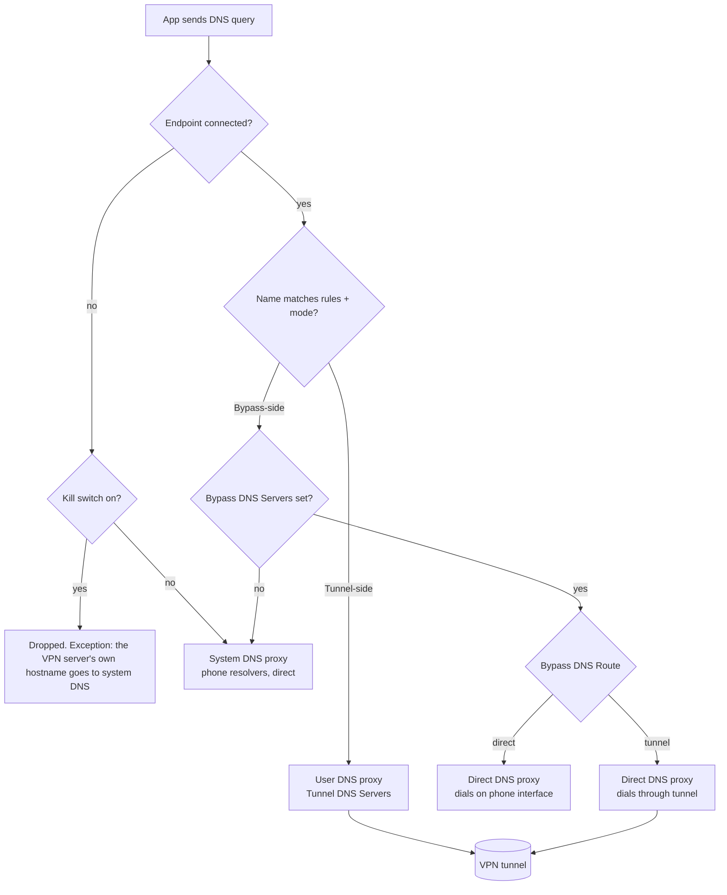
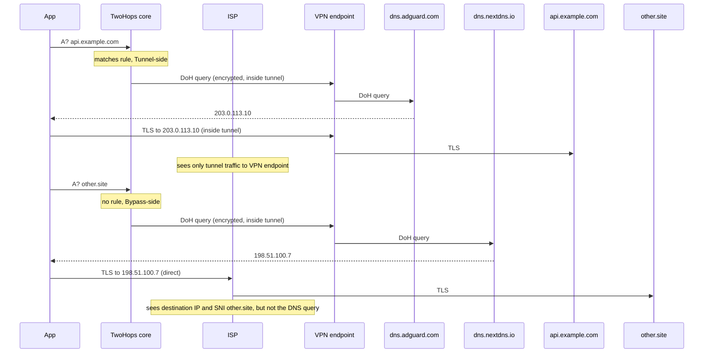

# DNS resolution paths

How a DNS query travels when the tunnel is up, which network it uses, and what
the ISP can still see. Uses the terms from `CONTEXT.md` (Tunnel DNS Servers,
Bypass DNS Servers, Bypass DNS Route, Tunnel-side Query, Bypass-side Query).

Traced against the fork `minlaxz/TrustTunnelClient`, branch `twohops`, files
`core/src/dns_handler.cpp` and `core/src/tunnel.cpp`. Not verified by packet
capture yet.

## Supported resolver formats

Both DNS lists accept the same formats. The app does not validate them; it
splits on commas and hands the strings to the core.

| Format             | Example                             |
| ------------------ | ----------------------------------- |
| Plain DNS          | `8.8.8.8:53`                        |
| Plain DNS over TCP | `tcp://8.8.8.8:53`                  |
| DNS-over-TLS       | `tls://1.1.1.1`                     |
| DNS-over-HTTPS     | `https://dns.adguard.com/dns-query` |
| DNS-over-QUIC      | `quic://dns.adguard.com:8853`       |
| DNS stamp          | `sdns://...`                        |

## The three resolver proxies

The core runs up to three DNS proxies. Every DNS query an app sends is caught
by the tunnel and handed to one of them.

1. **User DNS proxy.** Backed by the Tunnel DNS Servers. Its outgoing
   connections go through an internal SOCKS listener that the core always
   routes into the tunnel. Rules never apply to it.
2. **Direct DNS proxy.** Backed by the Bypass DNS Servers. With Bypass DNS
   Route `direct` it dials on the phone's own network interface, outside the
   TUN device. With Route `tunnel` it uses the same SOCKS listener as the user
   DNS proxy, so it also goes through the tunnel.
3. **System DNS proxy.** Backed by the phone's system resolvers, always direct.
   Used only when the Bypass DNS Servers list is empty, or briefly while
   Route `tunnel` waits for the endpoint to connect.

## Which proxy answers a query



TwoHops always sets the kill switch on, so the "no" branch under it does not
happen in this app.

## DoH and DoT: resolving the resolver

A DoH or DoT server named by hostname must itself be resolved first. This
"bootstrap" step is fixed by the core, not configurable:

| Proxy            | Route         | DoH/DoT dial    | Bootstrap resolver                              |
| ---------------- | ------------- | --------------- | ----------------------------------------------- |
| User DNS proxy   | always tunnel | through tunnel  | AdGuard public IPs, through tunnel              |
| Direct DNS proxy | `direct`      | phone interface | phone system resolvers, AdGuard IPs as fallback |
| Direct DNS proxy | `tunnel`      | through tunnel  | AdGuard public IPs, through tunnel              |

The bootstrap connection carries the DoH hostname as its destination and is
exempt from the rules, which prevents a routing loop. It never shows up in the
Traffic Log as a bypass or tunnel row.

## Example: selective mode, both lists DoH, Route `tunnel`

Profile:

- Routing Mode: selective, rule `*.example.com`
- Tunnel DNS Servers: `https://dns.adguard.com/dns-query`
- Bypass DNS Servers: `https://dns.nextdns.io/abc123`
- Bypass DNS Route: `tunnel`



## What the ISP can see

With both lists set and Bypass DNS Route `tunnel`:

- **No DNS query reaches the ISP's resolvers** once the endpoint is
  connected. Both proxies dial through the tunnel.
- **While connecting**, the kill switch drops app queries. The one exception
  is the VPN server's own hostname, which the core may resolve through system
  DNS. Profiles already hand the core the server IP, so this rarely fires.
- **Bypassed connections are still visible.** The DNS answer is private, but
  the TCP/TLS connection that follows goes direct. The ISP sees the destination
  IP and, for TLS, the SNI. That is what Bypass means.
- **App-level secure DNS** (Chrome, Firefox, Android Private DNS) is ordinary
  HTTPS traffic. The rules route it like anything else. It is not a leak, but it
  skips your chosen resolvers and their filtering.

With Bypass DNS Route `direct`, Bypass-side Queries dial on the phone's
interface. DoH/DoT still hides the query contents, but the ISP sees the
connection to the resolver, and the bootstrap lookup for the resolver's
hostname goes to the phone's system resolvers in plain DNS.

## How to check on a device

```sh
adb logcat | grep -E "system DNS proxy|direct DNS proxy|-> DNS proxy"
```

After the endpoint connects, every query line should end in `DNS proxy` or
`direct DNS proxy`. A `system DNS proxy` line after connect means a query left
on the phone's resolvers.
